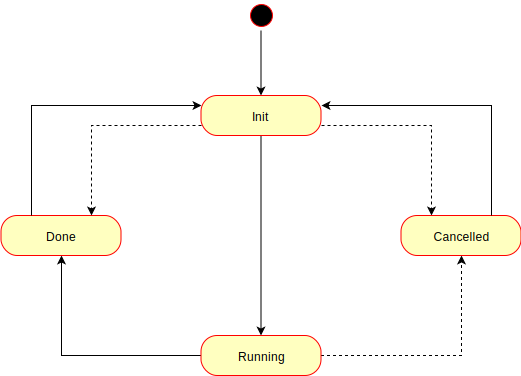

# CommandBase

## Purpose of this document

Describe the principles of a `CommandBase` Class.

## States

The Button has the following default states represented as the `stHandshake.nResultCode` and defined in `E_CommandResultCode`. The following diagram shows in bold lines the regular state flow and in the dashed lines the possible alternative flow.


> It is possible to set `stHandshake.nResultCode` to any `UINT` value for custom purpose. The result code can be set trouth the `Done` Methode.

## Methods

See in the TwinCat 3 Library Manager, in the library. Expand the Command folder and then expand also the `CommandBase` Class to show the methods. By selection of each Method it will show the explanation.

## Communication structure to PCS

In the structure `ST_CommandBaseHandshake` is used to communicate with the PCS. The flags `bExecute` and `bBusy` has a Impact to command [state](#States).

| Symbol Name   | Datatype | PLC | PCS | Description                                                                                                                                                                                                                            |
|---------------|----------|-----|-----|----------------------------------------------------------------------------------------------------------------------------------------------------------------------------------------------------------------------------------------|
| `bExecute`    | BOOL     | RW  | RW  | Will be set to true from the PCS to start the command. When the operation is finished, the PLC will it set to false. On a long running Task, the PCS can reset to false for Abort the operation. The state will change to `Cancelled`. |
| `bBusy`       | BOOL     | RW  | R   | Is True when the command is executing.                                                                                                                                                                                                 |
| `nResultCode` | UINT     | RW  | R   | Shows the operation result code of the commando state. Default Values see `CommandResultCode` Enum Type. It is possible to set other codes!                                                                                            |
| `nProgress`   | BYTE     | RW  | R   | Shows the optional calculated progress. The value is depend on the command implementation. (default can be 0..100%). Only necessary on long running operations.                                                                        |
| `nSubTask`    | UINT     | RW  | R   | Shows the optional state of long running Command Execution. It is possible to set it on own need.                                                                                                                                      |


### Values of CommandResultCode:

```
TYPE E_CommandResultCode :
(
	Init 			:= 0,
	Running 		:= 1,
	Done 			:= 2,
	Cancelled 		:= 3,
	StartCustom 	:= 100
) UINT;
END_TYPE
```

## Quick start with your first Command

**Goal:** 
Get the information when the command are executed triggered from the PCS (there is maybe a button). We wanna only a simple impulse when that happen on the output `Q`. 

First add a new POU for the Command that extends the Library Class `CommandBase`.

Basely you have a working command that does nothing important. So we add a Output Parameter `Q`. Also a `bInit` for later use.

```
FUNCTION_BLOCK PUBLIC StartCommand EXTENDS CommandBase
VAR_INPUT
END_VAR
VAR_OUTPUT	
	Q : BOOL;
END_VAR
VAR
	bInit 	: BOOL;
END_VAR
```

Then we ned to now when the Command is executed. For that we add a Method with the Name `Init` to the Class.

```
METHOD PROTECTED Init

// Init Code:
bInit := TRUE;
```

The Next step is to implement to logic Part of the command, to ged the information when the command are executing and to set the the impulse on `Q` when that happens. For this add a Method with the Name `Task` to the Class.

```
METHOD PROTECTED Task : BOOL
	
// Task Code:
// dedect task completed
IF (NOT bInit AND Q) THEN
	// Task comlete;
	Task := SUPER^.Task();;
END_IF

// set output trigger
Q := bInit;

// Reset after 1. cycle
bInit := FALSE;
```

The next step is to Declare the POU on a Global Variable List, in this example it is on `Commands`:

```
VAR_GLOBAL
	StartCommand1		: StartCommand;
END_VAR
```

In the main Program you should now call the Button in a cycle behavior.

```
Commands.StartCommand1.Call();
	
fbTofStartCommand1(
	IN := Commands.StartCommand1.Q,
	PT := T#1S);		
```

Now there is simple Start Button created.

To Test the correctness of the behavior. Set the following internal `SartCommand` flag `Commands.StartCommand1.stHandshake.bExecute` in the online Scope to True.